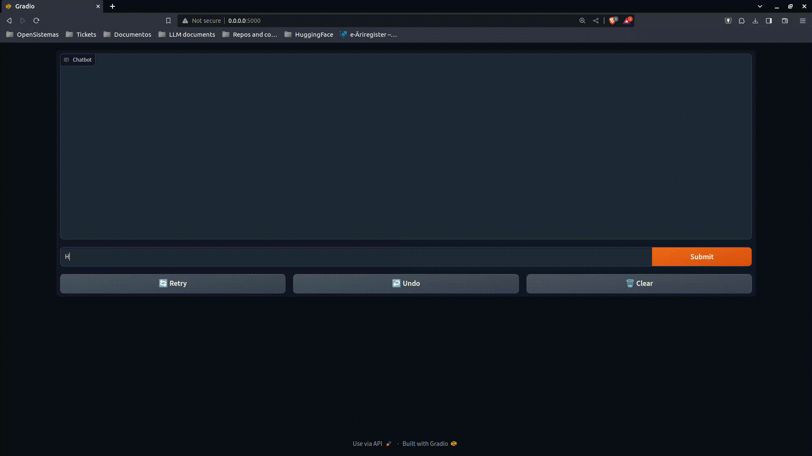

<div align="center">
  <a href="https://opensistemas.com/">
    
  </a>
</div>

# Chat Interface for Hugging Face 🤗 Hub Models 🚀


## Description 📋
This project implements a Gradio chat interface that integrates various Hugging Face Hub conversational AI models. It allows easy interaction with models like Llama-2-7b, Openchat_3.5, and several others through a user-friendly chat interface.

## Installation and Requirements 🛠️
Ensure you have Python 3.8+ installed. Clone this repository and install the required dependencies:
```bash
git clone https://github.com/opensistemas-hub/LLM_chatapp.git
cd LLM_chatapp
pip install -r requirements.txt
```

You can see an easy demo here:


## Usage 🌟
Run the application with the following command, specifying the Hugging Face Hub model name:
```bash
python app.py --model-name "MODEL_NAME"
```

The application supports various arguments for customization:

- `--model-name`: Model name from HuggingFace Hub or local path.
- `--memory-limit`: Sets the memory limit for past interactions.
- `--max-new-tokens`: Maximum new tokens for model responses.
- `--temperature`: Controls the generation temperature.
- `--top-k`: Sets Top K sampling for text generation.
- `--top-p`: Sets Top P sampling for text generation.
- `--server-port`: Designates the port for the Gradio server.
- `--server-name`: Sets the server name for the Gradio interface.

Feel free to do any PR to improve and add more parameters.

### Supported models 💻
Any model in Hugging Face Hub with `chat_template` in [`tokenizer_config.json`](https://huggingface.co/meta-llama/Llama-2-7b-chat-hf/blob/c1b0db933684edbfe29a06fa47eb19cc48025e93/tokenizer_config.json#L12) file. 

You can create your template for your own model following [this](https://huggingface.co/docs/transformers/chat_templating) documentation. Feel free to do a PR in case you improve any of the templates in the folder `chat_templates/templates.py`

- **Llama-2-7b Chat (meta-llama/Llama-2-7b-chat-hf)**: A robust model for diverse conversational contexts. [Learn More](https://huggingface.co/meta-llama/Llama-2-7b-chat-hf).
- **Openchat 3.5 (openchat/openchat_3.5)**: Designed for open-domain chatting. [Learn More](https://huggingface.co/openchat/openchat_3.5).
- **Stablelm-zephyr-3b (stabilityai/stablelm-zephyr-3b)**: A "small" but powerful model deployable with just 2GB of VRAM created by StabilityAI. [Learn More](https://huggingface.co/stabilityai/stablelm-zephyr-3b).
- **TinyLlama (TinyLlama/TinyLlama-1.1B-Chat-v1.0)**: The smallest chat model based on Llama2 architecture. It works amazing on english. [Learn More](https://huggingface.co/TinyLlama/TinyLlama-1.1B-Chat-v1.0)
- **Mistral-7B OpenOrca (Open-Orca/Mistral-7B-OpenOrca)**: Optimized for interactive and engaging conversations. [Learn More](https://huggingface.co/Open-Orca/Mistral-7B-OpenOrca).
- **Mistral-7B Instruct v0.1 (mistralai/Mistral-7B-Instruct-v0.1)**: Focuses on instruction-based responses. [Learn More](https://huggingface.co/mistralai/Mistral-7B-Instruct-v0.1).
- **Falcon-180B Chat (tiiuae/falcon-180B-chat)**: A large-scale model with extensive knowledge. [Learn More](https://huggingface.co/tiiuae/falcon-180B-chat).
- **Neural Chat 7b v3.1 (Intel/neural-chat-7b-v3-1)**: Incorporates advanced natural language understanding capabilities. [Learn More](https://huggingface.co/Intel/neural-chat-7b-v3-1).
- **LightGPT (amazon/LightGPT)**: A lightweight model for efficient chatting. [Learn More](https://huggingface.co/amazon/LightGPT).
- Any model in Hugging Face Hub with defined `chat_template`: [Here](https://huggingface.co/meta-llama/Llama-2-7b-chat-hf/blob/c1b0db933684edbfe29a06fa47eb19cc48025e93/tokenizer_config.json#L12) is an example for Llama2.

Additionally, users can integrate any Hugging Face Hub model that has a defined `chat_template`. For guidance on creating a template for your own model, consult the [Hugging Face Chat Templating Documentation](https://huggingface.co/docs/transformers/chat_templating). If you create or improve a template, we encourage you to submit a Pull Request to the `chat_templates/templates.py` folder in our repository.

## License 📄
This project is licensed under the MIT License - see the [LICENSE](LICENSE) file for details

## About us and contact 🌐

OpenSistemas is a spanish company specializing in providing innovative technology solutions and services. We focus on areas such artificial intelligence, data science, data management, analytics, cloud computing and big data, aiming to enhance business efficiency and drive digital transformation for our clients.

If you want to know more about us, don't forget to visit our [website](https://opensistemas.com)
